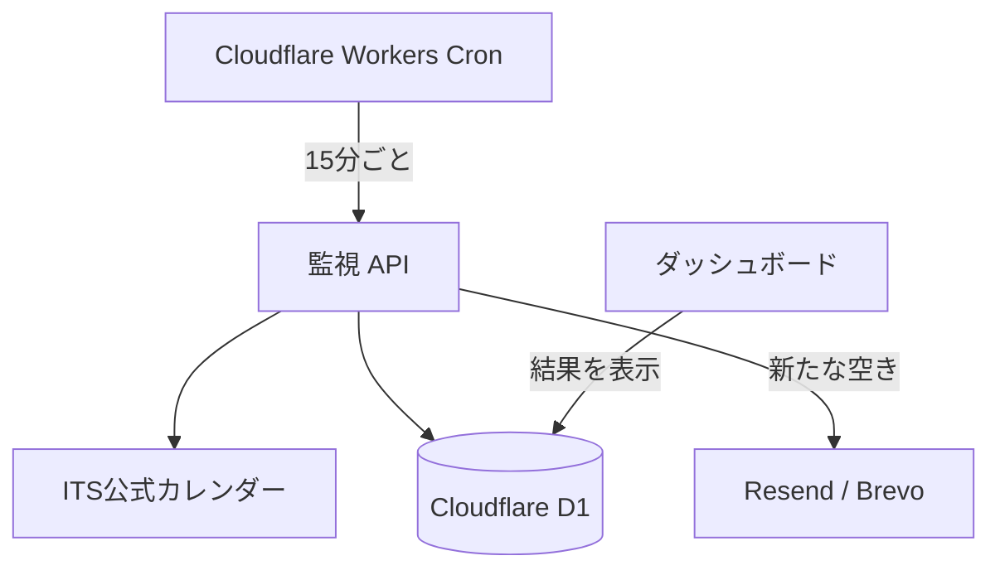

# ITS 空室ウォッチ

ITS健保の保養施設について、希望日の空室を監視する個人用Webアプリです。泊まりたい施設・日付を登録し、新たな空きが見つかったときにメールで知らせます。

## 主な機能

- ITS公式の施設一覧と同期し、施設・宿泊日・泊数・人数・通知先を登録
- 条件ごとに監視を一時停止・再開・削除
- 公式カレンダーの `○`（空きあり）、`△`（残りわずか）、`×`（空きなし）を読み取り表示
- Cloudflare Workers の Cron Trigger から15分ごとにサーバー側で確認
- `空きなし → 空きあり／残りわずか` を検知したときにメール通知。満室に戻れば、次の空きに対して再通知
- 画面表示中はサーバー側の保存結果を約1分ごとに読み直し、タブへ戻ったときも更新
- 公式申込画面へのリンク。ITS側の認証・日付・泊数・人数の選択は利用者が行う

## 構成

| 用途 | 技術 |
| --- | --- |
| 画面・API | Next.js、React、TypeScript、Tailwind CSS |
| データ保存 | Cloudflare D1、Drizzle ORM |
| 定期実行 | Cloudflare Workers Cron Trigger（別管理のWorker） |
| 通知 | ResendまたはBrevoのメールAPI |
| アクセス制御 | ホスティング側の認証。監視データはユーザーIDで分離 |

`app/api/cron/check/route.ts` がサーバー側の監視・通知を担当します。画面からの「今すぐ確認」は `app/api/watches/[id]/check/route.ts`、開いている間の定期確認は `app/api/watches/check-active/route.ts` です。画面からの確認ではメールを送りません。

## 実行・公開について

このリポジトリはアプリのソースコードです。運用中のサイト、データベース、通知用Worker、メール送信の認証情報は公開していません。公開用の `hosting.example.json` にはローカル開発用のバインディング名だけを記載し、運用サイトの `.openai/hosting.json` は含めていません。

自分の環境に配置する場合は、Cloudflare D1、ホスティング側のユーザー認証、Cron Trigger、メール送信サービスをそれぞれ設定する必要があります。`CRON_SECRET`、`RESEND_API_KEY` または `BREVO_API_KEY` などの実値をGitにコミットしないでください。

ITSの空室表示を参照する補助ツールであり、空室の確保や申込は行いません。カレンダーの記号は人数別の在庫数を示すものではありません。
